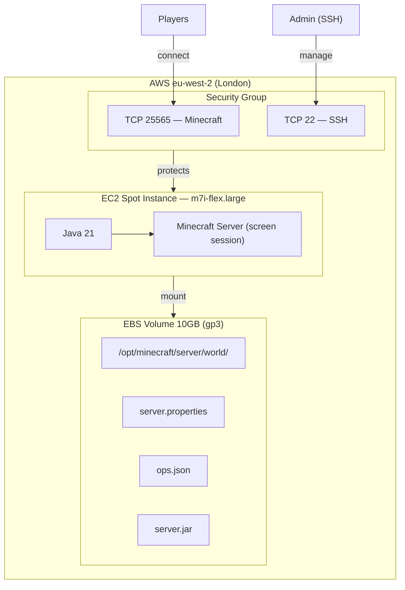
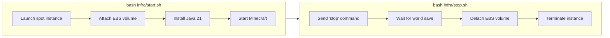

# Knot Minecraft Server

A set of bash scripts to run a Minecraft Java Edition server on AWS with minimal cost. Designed for a small group of friends playing casually.

## Architecture





**How it works:** When you run `start.sh`, a cheap spot instance launches in London, the persistent EBS volume (containing your world data) is attached, Java and Minecraft are installed if needed, and the server starts. When you run `stop.sh`, the Minecraft server saves the world, the EBS volume is safely detached, and the instance is terminated. You only pay for compute while you're actually playing.

**Why spot instances?** Spot instances use AWS's spare capacity at ~60-70% discount. The m7i-flex.large costs ~$0.046/hr spot vs ~$0.12/hr on-demand. The tradeoff is AWS can reclaim the instance with 2 minutes notice, but this is rare and your world is saved on EBS regardless.

## Cost Estimate

Assuming 3 sessions/week, ~3 hours each (~36 hours/month):

| Resource | Rate | Monthly |
|---|---|---|
| EC2 spot (m7i-flex.large) | ~$0.046/hr | ~$1.66 |
| EBS volume (10GB gp3) | $0.08/GB/month | $0.80 |
| Data transfer | free (under 100GB) | $0.00 |
| **Total** | | **~$2.50/month** |

The EBS volume ($0.80/month) is the only cost when the server is off.

## Game State and Persistence

**The world is NOT stored in this git repo.** It lives on an AWS EBS volume (`vol-REDACTED`) in eu-west-2. This volume persists independently of any EC2 instance — it's like an external hard drive in the cloud.

The EBS volume stores:
- `world/` — the Minecraft world (terrain, builds, player inventories)
- `server.properties` — server settings (render distance, difficulty, etc.)
- `ops.json` — the OP list
- `server.jar` — the Minecraft server binary
- `whitelist.json`, `banned-players.json`, etc.

**What this means for your friends:** They cannot start the server from their own machine unless they have access to the AWS account. The scripts and `.env` file (containing resource IDs) are needed, plus the `minecraft` AWS CLI profile configured with credentials. If you want a friend to be able to start/stop the server:

1. Give them the AWS access key and secret key for the `minecraft-server` IAM user
2. They run: `aws configure --profile minecraft` and enter the credentials
3. They clone this repo and copy the `infra/.env` file (it's gitignored, so share it directly)
4. They can then run `bash infra/start.sh` and `bash infra/stop.sh`

## IAM User and Security

A dedicated IAM user `minecraft-server` was created with **least-privilege permissions**. It can only:

- Launch, describe, and terminate EC2 instances
- Create, describe, attach, detach, and delete EBS volumes
- Manage security groups and key pairs
- Create the EC2 Spot service-linked role
- Create resource tags

It **cannot**: access S3, IAM (beyond the spot role), billing, other AWS services, or any resources outside EC2. If the credentials are compromised, the blast radius is limited to EC2 in this account.

The AWS CLI profile `minecraft` is configured locally at `~/.aws/credentials` and referenced automatically by all scripts via `export AWS_PROFILE=minecraft` in the `.env` file.

**Network security:**
- The security group only opens two ports: **25565** (Minecraft) and **22** (SSH)
- Both are open to `0.0.0.0/0` (the whole internet) — this is necessary so friends on different networks can connect
- SSH access requires the private key (`minecraft-server-key.pem`) which is gitignored
- The Minecraft server runs with `online-mode=true`, meaning only authenticated (paid) Minecraft accounts can connect

**Sensitive files excluded from git:**
- `.env` — contains AWS resource IDs
- `*.pem` — SSH private key

## Usage

### Prerequisites

- [AWS CLI](https://aws.amazon.com/cli/) installed
- The `minecraft` AWS CLI profile configured (already done on Kyle's machine)

### Start the server

```bash
bash infra/start.sh
```

Outputs the public IP. Share it with friends — they connect in Minecraft via Multiplayer → Add Server. The server takes 2-3 minutes to be ready on first boot (installs Java + downloads Minecraft), and about 1 minute on subsequent boots.

### Check server status

```bash
bash infra/status.sh
```

Shows whether the server is running and the current IP address.

### Stop the server

```bash
bash infra/stop.sh
```

Gracefully stops Minecraft (saves the world), detaches the EBS volume, and terminates the instance. **Always use this instead of terminating the instance manually** to ensure the world is saved.

### SSH into the server

```bash
ssh -i minecraft-server-key.pem ec2-user@<IP>
```

To access the Minecraft console:

```bash
sudo screen -r minecraft
```

Detach from the console with `Ctrl+A, D` (do NOT close the terminal or use Ctrl+C, as that would kill the server).

### Destroy everything

```bash
bash infra/teardown.sh
```

**This permanently deletes the world, EBS volume, security group, and key pair.** Prompts for confirmation before proceeding.

## Server Settings

| Setting | Value |
|---|---|
| Minecraft version | Latest release (auto-downloaded) |
| RAM allocation | 3GB |
| Render distance | 16 chunks |
| Simulation distance | 10 chunks |
| Difficulty | Easy |
| Gamemode | Survival |
| Max players | 20 |
| Online mode | true |
| PvP | true |

Settings can be changed by SSHing in and editing `/opt/minecraft/server/server.properties`, then running `reload` in the Minecraft console.

## Current OPs

- REDACTED
- REDACTED
- REDACTED
