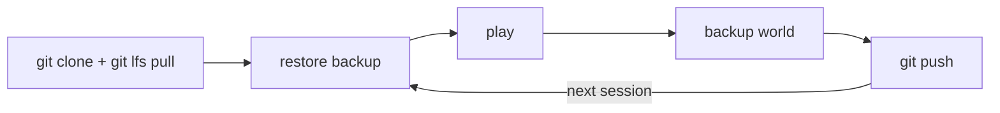

# Knot Minecraft Server

Bash scripts to run a Minecraft Java Edition server — locally or on AWS — with $0 idle cost.

## How it works

The world lives in `backups/world.tar.gz` (tracked by Git LFS). Clone the repo, host a session, back up, push. Anyone who clones can host — locally or on their own AWS account.



## Repo layout

```
.
├── backups/
│   └── world.tar.gz        # world backup (Git LFS)
├── docs/                    # detailed guides
├── infra/                   # AWS hosting scripts
│   ├── setup.sh             # one-time AWS setup
│   ├── start.sh             # launch server
│   ├── stop.sh              # stop + backup + teardown
│   ├── status.sh            # check server state
│   ├── backup.sh            # manual backup
│   ├── restore.sh           # manual restore
│   └── teardown.sh          # destroy AWS resources
├── local-start.sh           # host locally
└── .gitattributes           # Git LFS tracking
```

## Quickstart: Host locally

No AWS account needed. Requires Java 21+.

```bash
git lfs pull
bash local-start.sh
```

The server runs on `localhost:25565`. Type `stop` or Ctrl+C to shut down — the world is automatically backed up.

## Quickstart: Host on AWS

First-time setup (creates key pair + security group):

```bash
aws configure --profile minecraft
bash infra/setup.sh
```

Start and stop:

```bash
bash infra/start.sh    # launches server, prints IP
bash infra/stop.sh     # backs up world, tears down infra
```

After stopping, commit the backup:

```bash
git add backups/ && git commit -m "Update world backup" && git push
```

## Connecting to the server

Once the server is running, players connect in Minecraft:

1. Open Minecraft Java Edition
2. Go to **Multiplayer** > **Add Server**
3. Enter the server address:
   - **Local:** `localhost:25565` (same machine) or `<host-ip>:25565` (LAN)
   - **AWS:** the public IP printed by `start.sh` (e.g., `3.10.45.12:25565`)
4. Click **Done**, then select the server and click **Join Server**

For friends outside your local network, see [Sharing](docs/sharing.md) for IP finding and port forwarding.

## Features

- **Ephemeral EBS** — volume is created on start and deleted on stop. $0 when idle.
- **Auto-backup** — world is backed up to Git LFS every time the server stops.
- **Spot instances** — ~60-70% cheaper than on-demand (~$0.03/hr).
- **Any host** — anyone who clones the repo can host, locally or on their own AWS account.
- **Auto-restore** — `start.sh` restores the world from backup automatically.
- **One-command start/stop** — `start.sh` and `stop.sh` handle everything.

## Cost

Assuming 3 sessions/week, ~3 hours each (~36 hours/month):

| Resource | Rate | Monthly |
|---|---|---|
| EC2 spot (c7i-flex.large) | ~$0.03/hr | ~$1.08 |
| EBS volume (10 GB gp3) | created on start, deleted on stop | $0.00 |
| Data transfer | free (under 100 GB) | $0.00 |
| **Total** | | **~$1.08/month** |

## Docs

- [AWS Setup Guide](docs/aws-setup.md) — prerequisites, setup, start/stop, SSH, teardown
- [Architecture](docs/architecture.md) — diagrams, ephemeral EBS, spot instances
- [Security](docs/security.md) — IAM policy, network rules, sensitive files
- [Server Settings](docs/server-settings.md) — defaults and how to change them
- [Sharing](docs/sharing.md) — hosting for friends, multi-account, shared access
