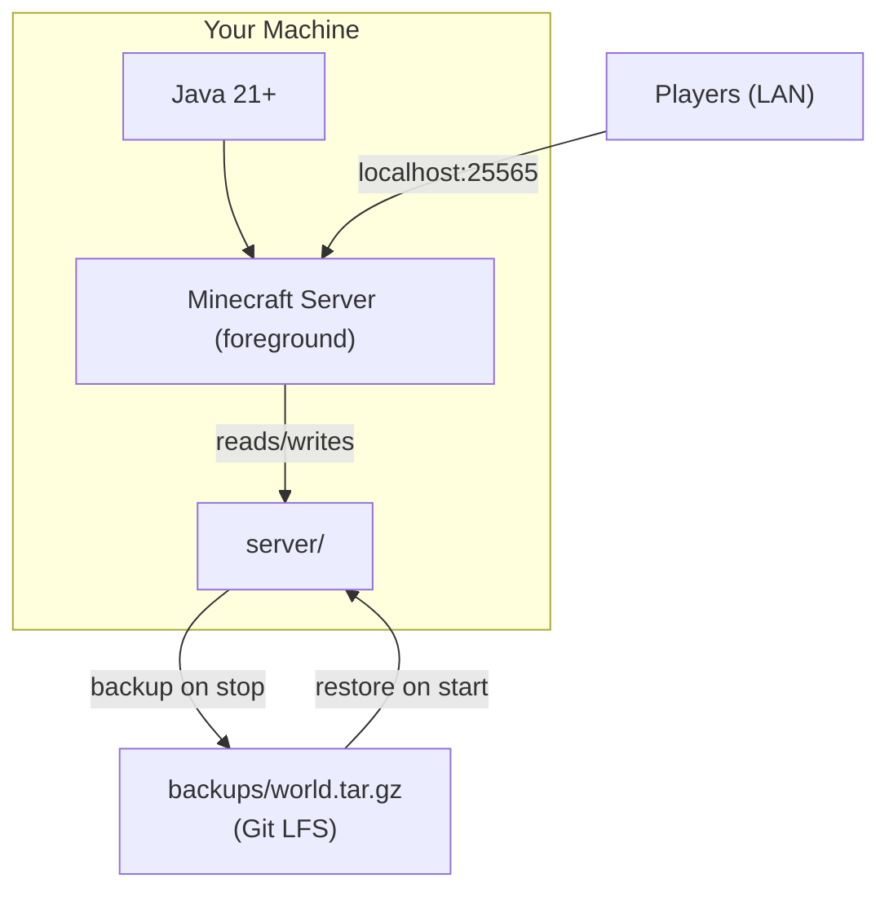
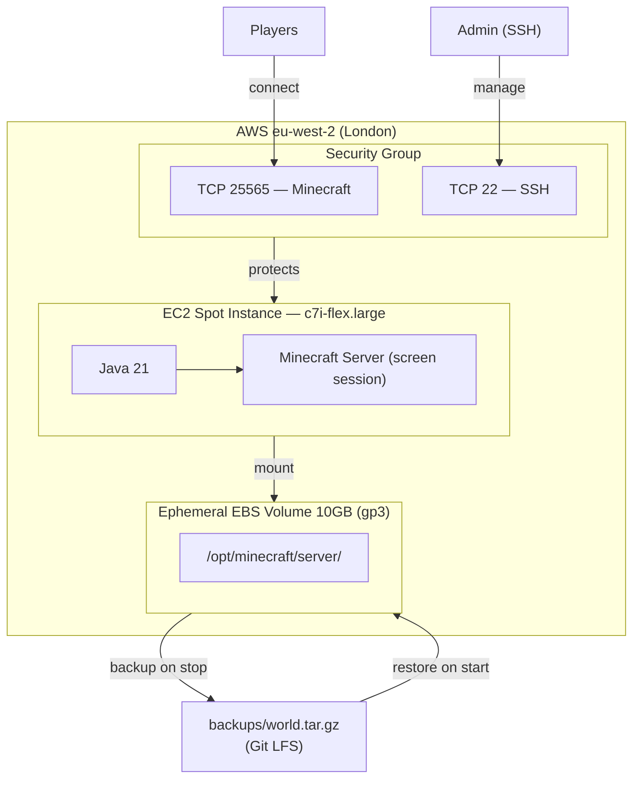

# Knot Minecraft Server

A set of bash scripts to run a Minecraft Java Edition server — locally or on AWS — with minimal cost. Designed for a small group of friends playing casually.

## Architecture

The world is stored as a tarball (`backups/world.tar.gz`) tracked by Git LFS. Anyone who clones the repo can host — either locally or on their own AWS account.

### Local hosting



### AWS hosting

```mermaid
graph LR
    subgraph start ["bash infra/start.sh"]
        direction LR
        S1["Create EBS volume"] --> S2["Launch spot instance"]
        S2 --> S3["Attach EBS, install Java"]
        S3 --> S4["Restore world from backup"]
        S4 --> S5["Start Minecraft"]
    end

    subgraph stop ["bash infra/stop.sh"]
        direction LR
        T1["Send 'stop' command"] --> T2["Wait for world save"]
        T2 --> T3["Backup world via SCP"]
        T3 --> T4["Delete EBS volume"]
        T4 --> T5["Terminate instance"]
    end

    start --> stop
```





**How it works:** The world lives in `backups/world.tar.gz` (tracked by Git LFS). When you run `start.sh`, a new EBS volume is created, a spot instance launches, the backup is restored onto it, and Minecraft starts. When you run `stop.sh`, the world is backed up, the EBS volume is deleted, and the instance is terminated. Nothing persists on AWS between sessions — **$0 when idle**.

**Why spot instances?** Spot instances use AWS's spare capacity at ~60-70% discount. The c7i-flex.large costs ~$0.03/hr spot vs ~$0.09/hr on-demand. The tradeoff is AWS can reclaim the instance with 2 minutes notice, but this is rare and `stop.sh` always backs up the world before shutting down.

## Cost Estimate

Assuming 3 sessions/week, ~3 hours each (~36 hours/month):

| Resource | Rate | Monthly |
|---|---|---|
| EC2 spot (c7i-flex.large) | ~$0.03/hr | ~$1.08 |
| EBS volume (10GB gp3) | created on start, deleted on stop | $0.00 |
| Data transfer | free (under 100GB) | $0.00 |
| **Total** | | **~$1.08/month** |

**$0 when idle** — the EBS volume is ephemeral and only exists while the server is running.

## Usage

### Host locally

No AWS account needed. Anyone who clones the repo can host:

```bash
git lfs pull              # download the world backup
bash local-start.sh       # starts Minecraft on localhost:25565
```

The server runs in the foreground — type `stop` or press Ctrl+C to shut down. When it exits, the world is automatically backed up to `backups/world.tar.gz`.

Requires Java 21+. The script will tell you how to install it if missing.

### Host on AWS

#### First-time setup

1. [Install the AWS CLI](https://aws.amazon.com/cli/)
2. Create a `minecraft` AWS CLI profile: `aws configure --profile minecraft`
3. Run one-time setup:

```bash
bash infra/setup.sh
```

This creates a key pair and security group. No EBS volume is created — `start.sh` handles that.

#### Start the server

```bash
bash infra/start.sh
```

Creates an EBS volume, launches a spot instance, restores the world from backup, and outputs the public IP. Share it with friends — they connect in Minecraft via Multiplayer > Add Server.

#### Stop the server

```bash
bash infra/stop.sh
```

Gracefully stops Minecraft, backs up the world, deletes the EBS volume, and terminates the instance. **Always use this instead of terminating the instance manually.**

After stopping, commit the backup:

```bash
git add backups/ && git commit -m "Update world backup" && git push
```

### Check server status

```bash
bash infra/status.sh
```

### Backup and restore (manual)

While the server is running on AWS, you can also back up or restore manually:

```bash
bash infra/backup.sh     # download world from running server
bash infra/restore.sh    # upload world to running server
```

### SSH into the server

```bash
ssh -i minecraft-server-key.pem ec2-user@<IP>
```

To access the Minecraft console:

```bash
sudo screen -r minecraft
```

Detach from the console with `Ctrl+A, D` (do NOT close the terminal or use Ctrl+C, as that would kill the server).

### Destroy everything

```bash
bash infra/teardown.sh
```

**This permanently deletes the security group and key pair.** Prompts for confirmation before proceeding.

## For Your Friends

**To host locally (easiest):**

1. Clone this repo and run `git lfs pull`
2. Run `bash local-start.sh`
3. Share your IP — friends connect to `<your-ip>:25565`

**To host on their own AWS account:**

1. Set up their own AWS account with a `minecraft` IAM profile
2. Clone this repo and run `git lfs pull`
3. Run `bash infra/setup.sh` then `bash infra/start.sh`
4. The world is automatically restored from the backup — same world, different account

**To share start/stop access on the same AWS account:**

1. Give them the AWS access key and secret key for the `minecraft-server` IAM user
2. They run: `aws configure --profile minecraft` and enter the credentials
3. They clone this repo and copy the `infra/.env` file (it's gitignored, so share it directly)
4. They can then run `bash infra/start.sh` and `bash infra/stop.sh`

## IAM User and Security

A dedicated IAM user `minecraft-server` was created with **least-privilege permissions**. It can only:

- Launch, describe, and terminate EC2 instances
- Create, describe, attach, detach, and delete EBS volumes
- Manage security groups and key pairs
- Create the EC2 Spot service-linked role
- Create resource tags

It **cannot**: access S3, IAM (beyond the spot role), billing, other AWS services, or any resources outside EC2. If the credentials are compromised, the blast radius is limited to EC2 in this account.

The AWS CLI profile `minecraft` is configured locally at `~/.aws/credentials` and referenced automatically by all scripts via `export AWS_PROFILE=minecraft` in the `.env` file.

**Network security:**
- The security group only opens two ports: **25565** (Minecraft) and **22** (SSH)
- Both are open to `0.0.0.0/0` (the whole internet) — this is necessary so friends on different networks can connect
- SSH access requires the private key (`minecraft-server-key.pem`) which is gitignored
- The Minecraft server runs with `online-mode=true`, meaning only authenticated (paid) Minecraft accounts can connect

**Sensitive files excluded from git:**
- `.env` — contains AWS resource IDs
- `*.pem` — SSH private key
- `server/` — extracted local server (only the tarball backup is tracked)

## Server Settings

| Setting | Value |
|---|---|
| Minecraft version | Latest release (auto-downloaded) |
| RAM allocation | 3GB |
| Render distance | 16 chunks |
| Simulation distance | 10 chunks |
| Difficulty | Easy |
| Gamemode | Survival |
| Max players | 20 |
| Online mode | true |
| PvP | true |

Settings can be changed by SSHing in and editing `/opt/minecraft/server/server.properties`, then running `reload` in the Minecraft console. For local hosting, edit `server/server.properties` directly.

## Current OPs

- REDACTED
- REDACTED
- REDACTED
