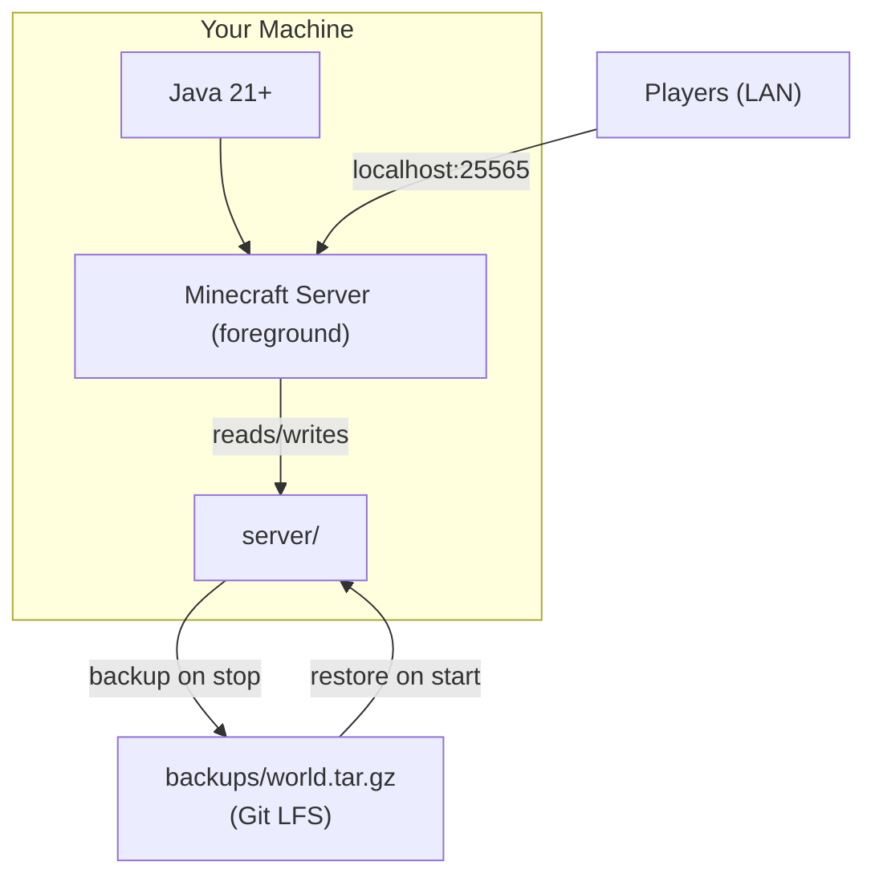
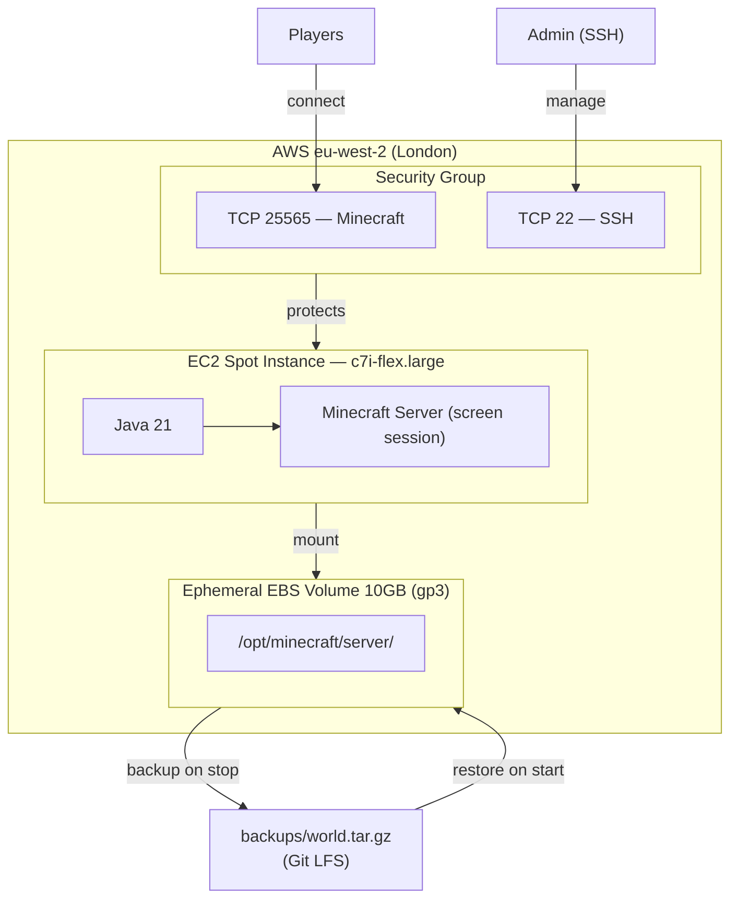

# Architecture

## Local hosting

The server runs directly on your machine. The world is restored from the Git LFS backup on start and backed up on stop.

## AWS hosting

On AWS, the server runs on a spot instance with an ephemeral EBS volume. The architecture keeps idle costs at $0.

### Start / stop lifecycle

```mermaid
graph LR
    subgraph start ["bash infra/start.sh"]
        direction LR
        S1["Create EBS volume"] --> S2["Launch spot instance"]
        S2 --> S3["Attach EBS, install Java"]
        S3 --> S4["Restore world from backup"]
        S4 --> S5["Start Minecraft"]
    end

    subgraph stop ["bash infra/stop.sh"]
        direction LR
        T1["Send 'stop' command"] --> T2["Wait for world save"]
        T2 --> T3["Backup world via SCP"]
        T3 --> T4["Delete EBS volume"]
        T4 --> T5["Terminate instance"]
    end

    start --> stop
```

## How ephemeral EBS works

The EBS volume only exists while the server is running:

1. **`start.sh`** creates a fresh 10 GB gp3 volume, launches a spot instance, and attaches the volume
2. The user-data script formats and mounts the volume at `/opt/minecraft`
3. The world backup is uploaded from `backups/world.tar.gz` and extracted onto the volume
4. **`stop.sh`** backs up the world via SCP, deletes the EBS volume, and terminates the instance

Because the volume is deleted after every session, there is **no EBS cost when idle**. The world persists only in the Git LFS backup.

## How spot instances work

Spot instances use AWS's spare EC2 capacity at a ~60-70% discount. The c7i-flex.large costs ~$0.03/hr spot vs ~$0.09/hr on-demand.

The tradeoff is that AWS can reclaim the instance with 2 minutes' notice. In practice this is rare for the instance types and regions used here. If it happens, you lose any progress since the last backup — but the world backup in Git is always safe.

`stop.sh` always backs up the world before shutting down, so normal usage is unaffected.

## What's in the backup

`backups/world.tar.gz` is a tarball of the entire `server/` directory. It contains:

- `server.jar` — the Minecraft server binary
- `world/` — the world data (terrain, player data, entities)
- `server.properties` — all server settings
- `ops.json` — operator list
- `whitelist.json` — whitelist (if enabled)
- `banned-players.json`, `banned-ips.json` — ban lists
- `eula.txt` — the accepted EULA

This means your settings, OP list, and bans all persist across sessions automatically. When `start.sh` restores from backup, the server picks up exactly where it left off.

## Why Git LFS

The world backup is a large binary file (typically 50-500 MB) that changes every session. Git is designed for text files and stores every version of every file — storing large binaries directly would bloat the repository quickly.

Git LFS (Large File Storage) solves this by storing large files on a separate server and only keeping lightweight pointers in the git repo. The `.gitattributes` file tells git to track `backups/*.tar.gz` with LFS.

Key commands:
- `git lfs pull` — download the actual backup file (needed after cloning)
- `git lfs install` — one-time setup if LFS isn't configured on your machine
- `git push` — automatically uploads the new backup to LFS when you push
